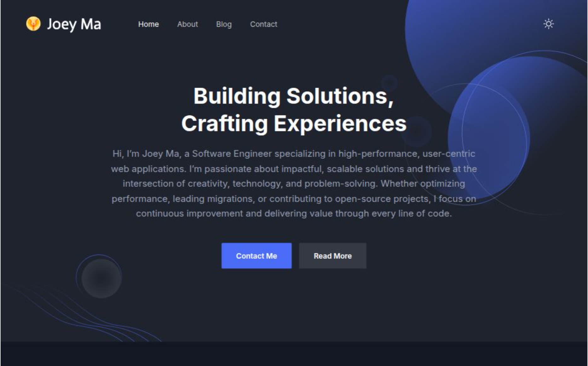

# joey-ma.github.io

## Overview

Welcome to my website! While this is (and likely will always be) a work-in-progress, I hope that eventually it will help showcase my skills, projects, and professional experiences!

### Features
- Home (`/`)
- About (`/about`)
  - Me
  - Projects I've worked on (work in progress)
- Blog (`/blog`) (work in progress)
- Contact (`/contact`)
- Dark Mode!

### Technology Stack
This portfolio was built using:
- [`Next.js`](https://nextjs.org/): For fast and efficient web development.
- [`Tailwind CSS`](https://tailwindcss.com/): For scalable, maintainable utility classes.
- [`GitHub Pages`](https://pages.github.com/): To deploy and host the website.
- [`GitHub Actions`](https://github.com/features/actions): For CI/CD task automations.
- [`PostHog`](https://posthog.com/): For web analytics.
- [`Checkly`](https://checklyhq.com/): For web monitoring and automated testing.

### License

This project is licensed under the MIT License. See the [LICENSE](https://github.com/joey-ma/joey-ma.github.io/blob/main/LICENSE) file for details.

## Acknowledgments

This project was initially based on [NextJSTemplates/startup-nextjs](https://github.com/NextJSTemplates/startup-nextjs). Many thanks to the creators for their great work!

Credit for the (cute) [quick brown fox](https://codepen.io/lynnandtonic/pen/YzQbVLZ) goes to [Lynn Fisher](https://codepen.io/lynnandtonic)